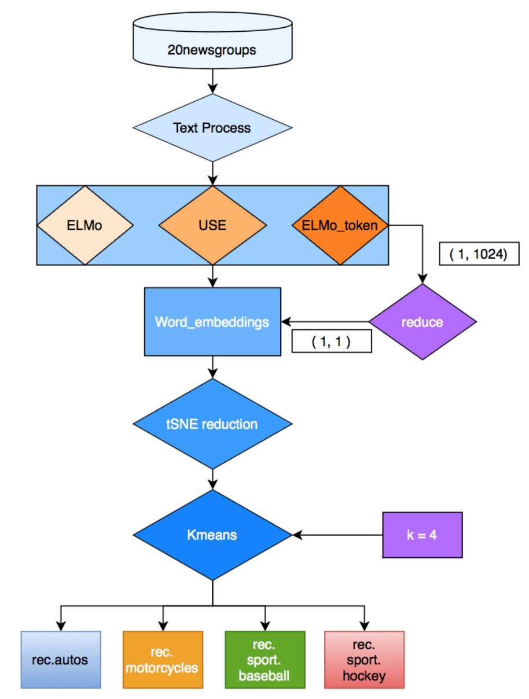
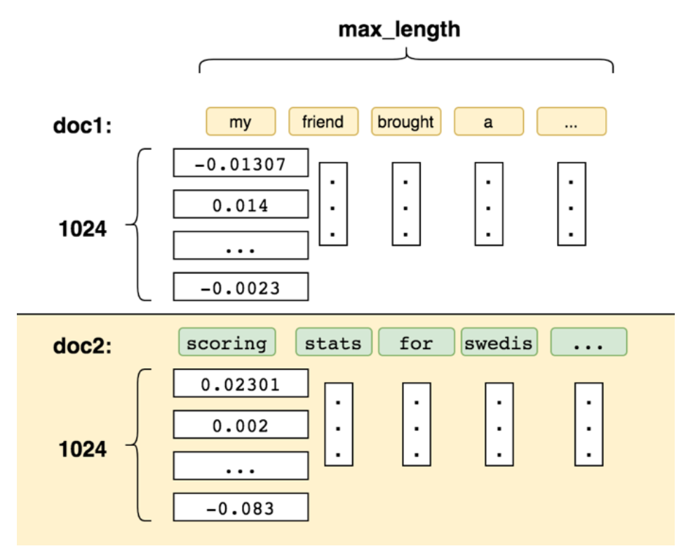
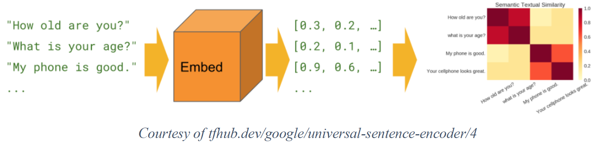
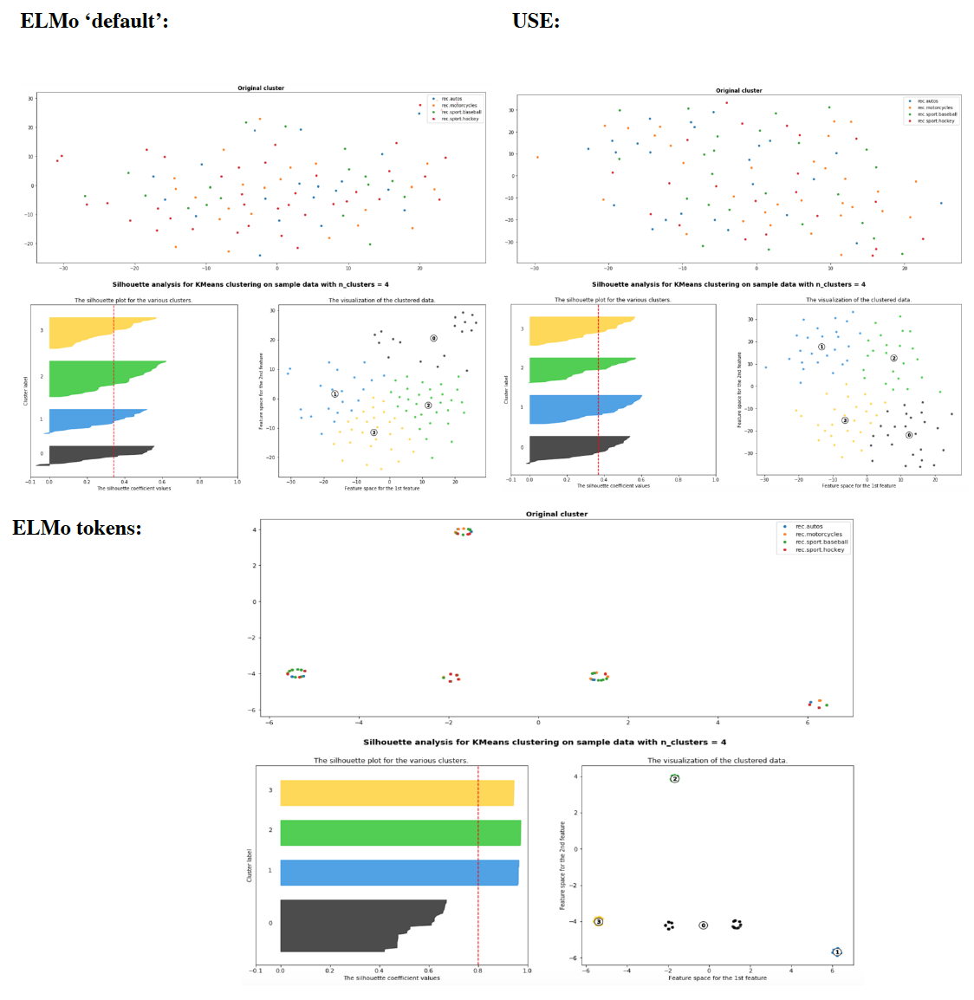

## 20newsgroups dataset Topic Modeling

#### Abstract
In this final research, I will explore embeddings solutions for Topic clustering of the 20newsgroups dataset. Since deep learning is expensive and time-consuming, I will utilize Transfer Learning. The 2 pre-trained models would be utilized are ELMo and Universal Sentence Embedding (USE), and they are publicly available on Tensorflow-hub. I perform 3 methods (ELMo, USE, ELMo tokens) of embedding and use Kmeans for clustering. The results will be evaluated using Silhouette analysis. From the analysis and visualization point of view, we can tell that ELMo tokens is able to push data points to separable clusters which help Kmeans to easily separating them. The better in performance can be explained by that ELMo embeds individual word with a 1024-dimension vector which provides more distinct information for the clustering task.

#### Introduction
For this final assignment, I’m continuing to explore pre-processing solutions for Topic clustering of the 20newsgroups dataset. In this research, I will explore 3 approaches: Transfer learning, Words and Sentence Encoding.
Deep Learning is expensive and time-consuming. Not everyone can afford a fancy machine or has the knowledge of a Phd. Hence, Transfer learning is desirable. It allows us to re-utilize/re-purpose the knowledge and the pre-trained models to solve related problems. The field of Computer vision has successfully adapted many pre-trained models (VGG, GoogleNet, YOLO, etc..). In NLP, there is a strive to build models that could be generalize enough to perform on different type of datasets. Word and sentence embeddings have become an essential part of any Deep-Learning-based natural language processing systems. A huge trend is the quest for Universal Embeddings: embeddings that are pre-trained on a large corpus and can be plugged in a variety of downstream task models (sentimental analysis, classification, translation…). These models learn general word/sentence representations on large datasets and are promised to improve performance.

#### Literature review:
##### ELMo:
NLP community has been trying to utilize deep learning to generate low dimensional contextual representations for better feature representation of sentence/document. Word2Vec and Glove are the first 2 prominent models which utilize neural network to represent word vectors. However, the main challenge with GloVe and Word2Vec is unable to differentiate the word used in a different context.

Elmo embedding, developed by Allen NLP, is a state-of-the-art pre-trained model available on Tensorflow Hub. It learns from the internal state of a bidirectional LSTM and represents contextual features of the input text. It’s been shown to outperform word2vec and Glove on a wide variety of NLP tasks.

##### Universal Sentence Embedding (USE):
USE encodes text into high dimensional vector which can be used for text classification, clustering etc… The pre-trained model is also available on Tensorflow Hub. In the paper, the authors explain the model “uses attention to compute context aware representations of words in a sentence that take into account both the ordering and identity of other words. The context aware word representations are averaged together to obtain a sentence-level embedding.”.

#### ELMo vs Universal Sentence Embedding
##### ELMo:
The pre-trained Elmo embedding module is available on Tensorflow-hub. The module exposes 4 trainable scalar weights for layer aggregation. For this project, I will focus on ONLY 2 outputs:
* default: a fixed mean-pooling of all contextualized word representations with shape [batch_size, 1024].
* elmo: the weighted sum of the 3 layers, where the weights are trainable. This tensor has shape [batch_size, max_length, 1024].
The most challenging part of utilizing ELMo embedding is the heavy workload. If I just load my X_train (2389 rows) to the model, the machine will crash. So, I have to break down my dataset to multiple mini-batches of 5 for training and pickle/store them for later uses.

##### default vector:
Using of ELMo ‘default’ output, it returns a 1-D vector of 1024 columns. This mean-pulling layer output has
similar characteristics to the doc2vec where the model vectorizes the entire text and ignoring individual word.
##### elmo vector:
This vector requires the most intensive processing power. The result is a 3-D vector [batch_size, max_length, 1024], where max_length is the number of tokens in the document and each token is mapped to a 1024 dimensions vector.Additional steps are needed to pre-process this embedding.
* First, each document will have different length, so I will pad the documents of shorter lengths with ‘DUMMY’ tokens so every document will have a consistent length.
* Second, each token will be compressed to 1-D vector before performing clustering. The compression output is the mean of the 1024-dimension matrix.
* Finally, since this type of embedding will focus on individual word, I’ve also added DROP_STOPWORD to the pre-processing steps so that only the relevant terms are present in the final processes.

##### Universal Sentence Embedding:
USE encodes text(not tokens) into high dimensional vectors. The model is available on Tensorflow-hub and the output is a vector of 512-dimension. This model does not require special pre-processing, but for this project, the input text received the same treatment like the input text for the ELMo’s `default` embedding.

#### Result
After pre-processing and utilizing tSNE for dimensions reduction, the final step is performing Kmeans on the vectors data.

#### Silhouette analysis:
S.A measure how close each point in a cluster is to the points in its neighboring clusters. Silhouette values lies in the range of [-1, 1]. +1 indicates that the sample is far away from its neighboring cluster and very close to the cluster its assigned. Similarly, value of -1 indicates that the point is close to its neighboring cluster than to the cluster its assigned.
The red dotted line is the mean Silhouette score for the cluster in consideration. For this to be a good value for number of clusters, one should consider the following points:
* The mean value should be as close to 1 as possible
* The plot of each cluster should be above the mean value as much as possible. Any plot region below the
mean value is not desirable.
* Lastly, the width of the plot should be as uniform as possible.
#### Conclusion:
Through visualization and scores, we can tell that ELMo tokens yield the most decent performance out of 3. It has the highest S. score and its S. cluster plots have the most uniform shapes. Additionally, from the distributional graph of the original clusters, we can see that ELMo tokens is able to push data points to separable clusters which help Kmeans to easily separate them. The better in performance can be explained by that ELMo looks at individual word and provides more distinct information to help with the clustering task.
